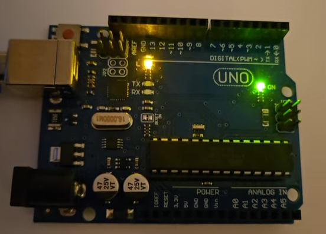
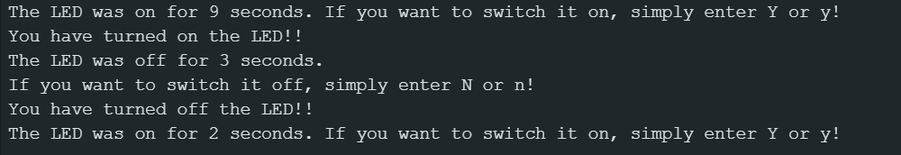

# Hello World!

It's time to bring the Arduino board online! I started with the classic _Blink_ tutorial, then learned the Serial Monitor with Hello World and an interactive LED power project.

## Blink

The goal of this tutorial is to teach the basics like variables, initialization, and the loop. I used digital Pin 13 for this one. The task was to make the **L** LED blink on for .1 seconds, and off for 1 second. This was a fairly easy task. 

```
//EXERCISE 1: Blink. On for .1 second, off for 1 second
int ledPin = 13;

void setup() {
  pinMode(ledPin, OUTPUT);
}

void loop() {
  digitalWrite(ledPin, HIGH);
  delay(100); // milliseconds
  digitalWrite(ledPin, LOW);
  delay(1000);
}
```
This took 944 bytes (2 %) of available flash memory to run and 9 bytes (0 %) of available dynamic memory for variable storage. 

## Don't Blink
This one was another similar task, but this time the goal was to keep the LED on. The code looked like this: 

```
// EXERCISE 2: Don't blink. Light on while running
int ledPin = 13;

void setup() {
  pinMode(ledPin, OUTPUT);
}

void loop() {
  digitalWrite(ledPin, HIGH);
}
```
This one took 724 bytes (2%) of the flash memory to run and 9 bytes (0 %) of the available dynamic memory for variables.




Comparing the two, "Don't blink" took less memory because it was a single task, though they both had the same space memory.

## Hello World
The code from this tutorial I copied from the [OSOYOO Robotics Kit Basics Tutorial - Lesson 6](https://osoyoo.com/2017/06/23/hello-world-2/). The goal of this one was to understand how Arduino can communicate with the Serial Monitor, and why getting the right baud rate is important to have clear communication exchange. As expected, it printed Hello World every 5 seconds. We're officially online!

This one used 1634 bytes (5%) of available flash memory, and the variables were 200 bytes (9%) of dynamic memory. 

## LED Switch and Serial Monitor
The final tutorial was to build a circuit, learn user input, and more about timing with the Serial Monitor. I copied the code from the [OSOYOO Robotics Kit Basics Tutorial - Lesson 7](https://osoyoo.com/2017/07/06/serial-monitor/), then modified it to get the behavior I wanted. The most challenging part was getting the circuit connected. I initially had a pin in misalignment, so after troubleshooting by checking the powered digital pin 2 went to the cathode of the LED by directly touching it with the lead (safely, of course), I realigned my circuit and we were off to the races! The next step of debugging was figuring out why my LED was always on or off for two seconds. Turns out, the original code had the count within the `if Serial.available()` loop, which meant it was only incrementing on change. After moving it outside, the circuit worked as expected.

```
// Exercise 4: LED Power
int redLedPin = 2;
int count = 0;
void setup() {
  pinMode(redLedPin, OUTPUT);
  Serial.begin(9600);
  while (! Serial);  // initialization
  Serial.println("Enter Y to turn on the LED:");
}

void loop() {
  delay(1000); count ++;
  if (Serial.available()) {
    char ch = Serial.read();
    if (ch == 'y' || ch == 'Y')
    {
      digitalWrite(redLedPin, HIGH);
      Serial.println("You have turned on the LED!!");
      Serial.print("The LED was off for ");
      Serial.print(count);
      Serial.println(" seconds. ");
      Serial.println("If you want to switch it off, simply enter N or n!");
      count = 0;
    }
    if (ch == 'n' || ch == 'N') {
      digitalWrite(redLedPin, LOW);
      Serial.println("You have turned off the LED!!");
      Serial.print("The LED was on for ");
      Serial.print(count);
      Serial.print(" seconds. ");
      Serial.println("If you want to switch it on, simply enter Y or y!");
      count = 0;
    }
  }
}
```



This program took 2658 bytes (8%) of available flash memory and 430 (20 %) of available dynamic memory.

## What I learned
These tutorials gave me a refresher on C++ and Arduino interface, as well as memory usage. It was interesting seeing how different tasks took more (or less) memory, particularly in the variable storage space. Most importantly, perhaps, was learning the basics of communication to and from the Arduino with the Serial Monitor, and how to accept input to change the circuit.
The big takeaways: 
- Arduino/C++ basics
- Circuit basics
- Memory and timing management
- Writing and uploading sketches
- The Serial Monitor

This foundation will help make STEVE a more efficient robot car. Next up: Sensor basics and Building Steve!

## References
- Basic Lesson 3-7 from [OSOYOO Robot Car Kit](https://osoyoo.com/2020/05/12/v2-1-robot-car-kit-for-arduino-tutorial-introduction/#3)
- [Simple LED with Arduino On a Breadboard - Rosie Research](https://www.youtube.com/watch?v=0nmDqKCMh3Q)

## [Return Home](https://megcrunyan.github.io/steve/)
